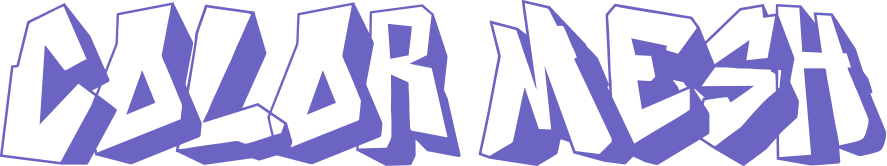

# ColorMesh

ColorMesh is a browser-based tool for extracting, sampling, and building color palettes from any image. Drop in an image, sample it on an adjustable grid, and pull the exact colors you need into a shareable palette.

**Live site:** [colormesh.net](https://colormesh.net)



## Features

- Drag-and-drop or click-to-upload images (PNG, JPEG, WEBP, GIF, BMP, SVG, AVIF)
- Adjustable sampling grid (2x2 up to 12x12), sampled with k-means clustering for accurate dominant colors per cell
- Click any grid cell to inspect its HEX/RGB values and add it straight to your palette
- Tap-to-toggle color picker in the sidebar — no need to open every swatch one at a time
- Build a 6-color palette, lock colors you want to keep, and randomize the rest
- Export sampled colors as JSON or CSV
- Export your palette as a formatted text file or a polished PNG image
- Light/dark theme, fully responsive (desktop sidebar + mobile drawer)

## Tech Stack

- [Next.js](https://nextjs.org) (App Router, static export)
- [React](https://react.dev) + TypeScript
- [Tailwind CSS](https://tailwindcss.com)
- [shadcn/ui](https://ui.shadcn.com) components on top of [Radix UI](https://www.radix-ui.com)
- [lucide-react](https://lucide.dev) icons

## Getting Started

### Prerequisites

- Node.js 18.18 or newer
- npm, pnpm, or yarn

### Installation

```bash
git clone https://github.com/real21yash/ColorMesh.git
cd ColorMesh
npm install
```

### Run locally

```bash
npm run dev
```

Open [http://localhost:3000](http://localhost:3000) in your browser. The page hot-reloads as you edit files.

### Build for production

This project is configured for static export (`output: 'export'` in `next.config.js`), so it builds to plain static files that can be hosted anywhere.

```bash
npm run build
```

The output is written to the `out/` directory. You can preview it locally with any static file server, e.g.:

```bash
npx serve out
```

### Deploying

Because it's a static export, ColorMesh can be deployed to any static host — Cloudflare Pages, Vercel, Netlify, GitHub Pages, S3, etc. Just point your host at the `out/` directory after running `npm run build`.

Before deploying your own copy, you'll probably want to:

- Update `baseUrl` in `app/layout.tsx` to your own domain
- Update `public/sitemap.xml` and `public/robots.txt` to match your domain
- Add your own `public/og-image.png` (1200x630) for social share previews
- Swap out `public/logo.svg` and the icon files in `public/` for your own branding
- Update the links in the "About" dialog (`components/controls-toolbar.tsx`)

## Project Structure

```
app/                 Next.js App Router entry (layout, page, global styles)
components/          App components (canvas, sidebar, toolbar)
components/ui/       shadcn/ui primitives
lib/                 Color sampling/export utilities
public/              Static assets (icons, logo, robots.txt, sitemap.xml)
```

## Contributing

Issues and pull requests are welcome. If you're planning a larger change, consider opening an issue first to discuss what you'd like to do.

## License

Licensed under the [MIT License](LICENSE).
